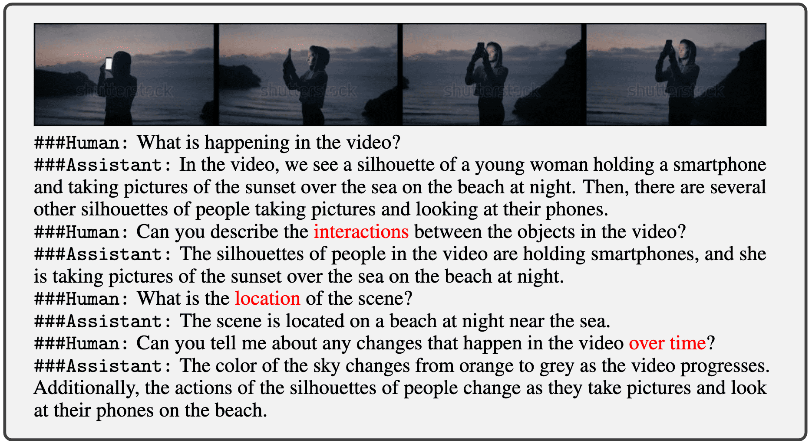

# Instruction data for [VideoChat](https://github.com/OpenGVLab/Ask-Anything/tree/main/video_chat)

# :fire: Updates
- **2023/05/11**: Release the **V1**: [Google Drive](https://drive.google.com/file/d/1C-7xmf42QUEi4ApXTcxBHr5nLvTWXyUi/view?usp=sharing) 

# :speech_balloon: V1: 7K description + 4K conversation

 We build a video-centric multimodal instruction data based on WebVid-10M. The corresponding detailed descriptions and question-answer generations are produced by ChatGPT based on video text (aided by [**VideoChat-Text**](https://github.com/OpenGVLab/Ask-Anything/tree/main/video_chat_with_ChatGPT)) with several prompts concerning **spatiotemporal features**. Compared with detailed video descriptions, video conversations are introduced to further improve the diversity, **temporal and casual features** in the video instruction data.

Example of detailed video description

Example of video conversation

