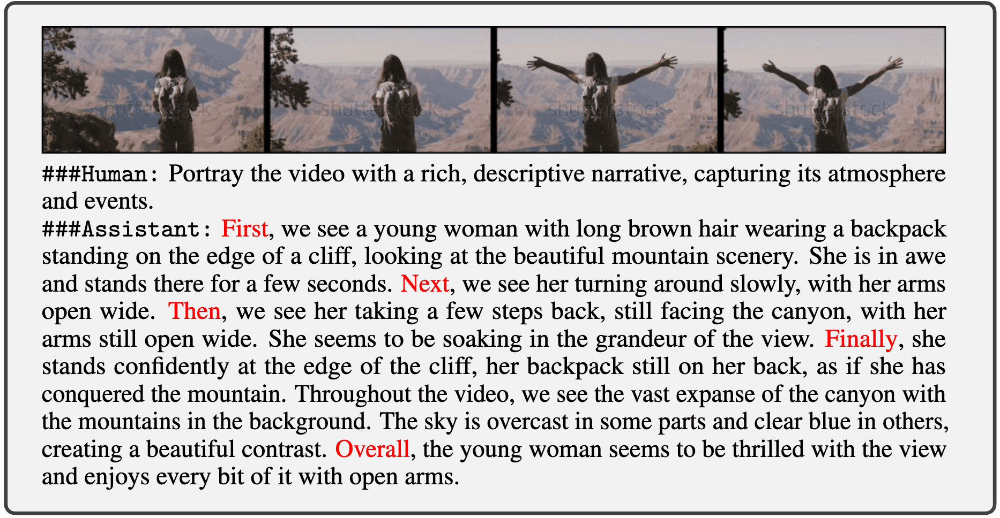

# Instruction data for [VideoChat](https://github.com/OpenGVLab/Ask-Anything/tree/main/video_chat)

# :fire: Updates
- **2023/05/11**: Release the **V1**: [Google Drive](https://drive.google.com/file/d/1C-7xmf42QUEi4ApXTcxBHr5nLvTWXyUi/view?usp=sharing) | [Aliyun OSS](https://pjlab-gvm-data.oss-cn-shanghai.aliyuncs.com/data/videochat/videochat_instruct_11k.json)

# :speech_balloon: V1: 7K detailed descriptions + 4K multi-turn conversations

 We build a video-centric multimodal instruction data based on WebVid-10M. The corresponding detailed descriptions and multi-turn conversations generations are produced by ChatGPT based on video text (aided by [**VideoChat-Text**](https://github.com/OpenGVLab/Ask-Anything/tree/main/video_chat_with_ChatGPT)) with several prompts concerning **spatiotemporal features**. Compared with detailed video descriptions, video conversations are introduced to further improve data diversity by introducing **temporal and casual features** in the video instruction data.

<div align="center">
Example of detailed video description
</div>
<div align="center">

</div>

<div align="center">
Example of video conversation
</div>
<div align="center">

</div>

# :page_facing_up: Citation

If you find this project useful in your research, please consider cite:
```BibTeX
@article{2023videochat,
  title={VideoChat: Chat-Centric Video Understanding},
  author={Li, Kunchang and He, Yinan and Wang, Yi and Li, Yizhuo and Wang, Wenhai and Luo, Ping and Wang, Yali and Wang, Limin and Qiao, Yu},
  journal={arXiv preprint arXiv:2305.06355},
  year={2023}
}

@article{wang2022internvideo,
  title={InternVideo: General Video Foundation Models via Generative and Discriminative Learning},
  author={Wang, Yi and Li, Kunchang and Li, Yizhuo and He, Yinan and Huang, Bingkun and Zhao, Zhiyu and Zhang, Hongjie and Xu, Jilan and Liu, Yi and Wang, Zun and Xing, Sen and Chen, Guo and Pan, Junting and Yu, Jiashuo and Wang, Yali and Wang, Limin and Qiao, Yu},
  journal={arXiv preprint arXiv:2212.03191},
  year={2022}
}
```
