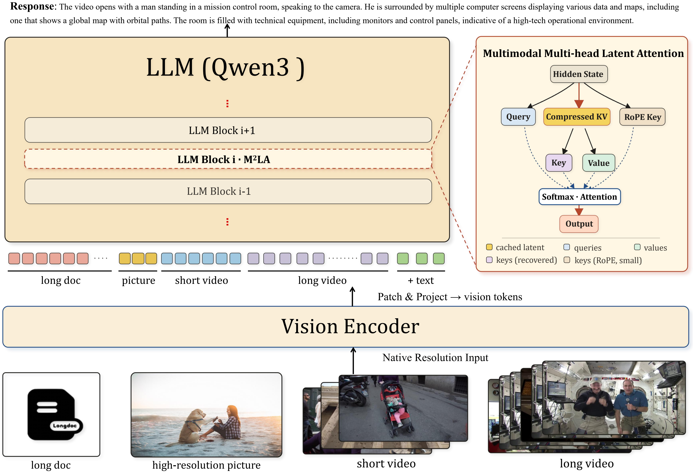
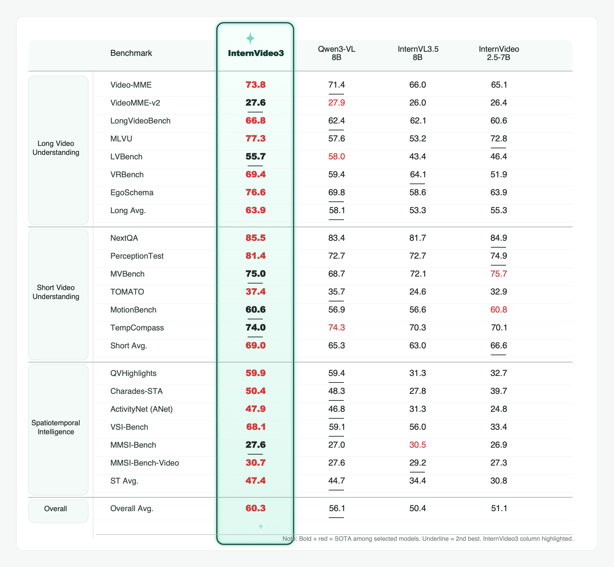

# InternVideo3: Agentify Foundation Models with Multimodal Contextual Reasoning

InternVideo3 is an open multimodal model for long-horizon video understanding and visually grounded agentic reasoning. It studies how to move multimodal foundation models beyond single-pass video QA by treating video understanding as a closed-loop process of evidence accumulation, belief update, tool interaction, and verification.

Project page: https://github.com/OpenGVLab/InternVideo/tree/main/InternVideo3



## Highlights

- **Multimodal Contextual Reasoning (MCR):** represents observations, instructions, intermediate reasoning, tool actions, feedback, and memory in a shared evolving context.
- **Multimodal Multi-head Latent Attention (M^2LA):** compresses KV-cache states while preserving the full multimodal token stream, making longer multimodal rollouts practical.
- **Long-video training recipe:** combines continued pretraining after M^2LA conversion, short-to-long supervised fine-tuning, rule-based reinforcement learning, and on-policy distillation.
- **Agentic video exploration:** supports recursive evidence gathering with tools such as segmentation, ASR, temporal grounding, search, summarization, and verification.
- **Strong open-weight performance:** achieves competitive results across long-video, short-video, temporal grounding, and spatial reasoning benchmarks.

## Method Overview

InternVideo3 is built around three complementary components:

1. **MCR:** a formulation for long-horizon multimodal reasoning where the model repeatedly observes, reasons, acts, receives feedback, and updates its contextual state.
2. **M^2LA:** a token-preserving attention reparameterization that reduces the KV-cache footprint for long multimodal contexts by storing compact latent states and reconstructing head-specific keys and values on the fly.
3. **Staged training:** a practical recipe that restores general capability after attention conversion and then specializes the model for dense video evidence and extended temporal dependencies.

## Model Zoo

| Model | Hugging Face |
| --- | --- |
| InternVideo3-8B-Instruct | [yanziang/InternVideo3-8B-Instruct](https://huggingface.co/yanziang/InternVideo3-8B-Instruct) |

## Quickstart

### Requirements

```bash
pip install "transformers>=4.57.3" torch qwen-vl-utils
```

### Load Model

```python
import torch
from transformers import AutoModelForCausalLM, AutoProcessor

model_path = "yanziang/InternVideo3-8B-Instruct"

model = AutoModelForCausalLM.from_pretrained(
    model_path,
    dtype=torch.bfloat16,
    attn_implementation="sdpa",
    device_map="auto",
    trust_remote_code=True,
)

processor = AutoProcessor.from_pretrained(
    model_path,
    trust_remote_code=True,
)
```

### Text Conversation

```python
messages = [
    {
        "role": "user",
        "content": [{"type": "text", "text": "Please introduce yourself."}],
    }
]

inputs = processor.apply_chat_template(
    messages,
    tokenize=True,
    add_generation_prompt=True,
    return_dict=True,
    return_tensors="pt",
).to(model.device)

output = model.generate(**inputs, max_new_tokens=1024, use_cache=True)
generated_ids = [o[len(i):] for i, o in zip(inputs.input_ids, output)]
print(processor.batch_decode(generated_ids, skip_special_tokens=True)[0])
```

### Video Understanding

```python
video_path = "your_video.mp4"
fps = 4
min_pixels = 128 * 2 * 32 * 32
max_pixels = 256 * 2 * 32 * 32

messages = [
    {
        "role": "user",
        "content": [
            {
                "type": "video",
                "video": video_path,
                "fps": fps,
                "min_pixels": min_pixels,
                "max_pixels": max_pixels,
            },
            {"type": "text", "text": "Please describe this video in detail."},
        ],
    }
]

inputs = processor.apply_chat_template(
    messages,
    tokenize=True,
    add_generation_prompt=True,
    return_dict=True,
    fps=fps,
    return_tensors="pt",
).to(model.device)

output = model.generate(**inputs, max_new_tokens=1024, use_cache=True)
generated_ids = [o[len(i):] for i, o in zip(inputs.input_ids, output)]
print(processor.batch_decode(generated_ids, skip_special_tokens=True)[0])
```

### Image Understanding

```python
messages = [
    {
        "role": "user",
        "content": [
            {"type": "image", "image": "your_image.jpg"},
            {"type": "text", "text": "Please describe this image in detail."},
        ],
    }
]

inputs = processor.apply_chat_template(
    messages,
    tokenize=True,
    add_generation_prompt=True,
    return_dict=True,
    return_tensors="pt",
).to(model.device)

output = model.generate(**inputs, max_new_tokens=1024, use_cache=True)
generated_ids = [o[len(i):] for i, o in zip(inputs.input_ids, output)]
print(processor.batch_decode(generated_ids, skip_special_tokens=True)[0])
```

## Training Recipe

InternVideo3 uses a staged recipe for long-horizon multimodal reasoning:

1. **Continued pretraining (CPT):** 16M multimodal samples, about 13.5B tokens, to re-stabilize the M^2LA-converted backbone and recover language and multimodal capability.
2. **Short-to-long SFT:** about 7.2M multimodal samples, including a curated long-video component with 379K videos, a mean duration of 15.8 minutes, and over 1M synthesized QA pairs.
3. **Rule-based reinforcement learning:** verifiable temporal grounding and multiple-choice video QA data with IoU/correctness rewards.
4. **On-policy distillation:** reasoning-heavy video QA and long-form description examples where a stronger teacher provides more complete or better-grounded behavior.

The long-video supervision emphasizes perception and recognition, spatial-temporal understanding, event and action reasoning, and holistic semantics.

## Dataset

The InternVideo3 long-video supervised fine-tuning data is available on Hugging Face:

| Dataset | Rows | Format |
| --- | ---: | --- |
| [yanziang/InternVideo3_Dataset](https://huggingface.co/datasets/yanziang/InternVideo3_Dataset) | 380K | JSON / Parquet |

Each sample contains a YouTube video id and QA annotations for detailed long-video description and reasoning.

## Evaluation

Evaluation scripts are provided in [InternVideo3_eval](InternVideo3_eval).

The benchmark comparison below is generated from the paper tables using `scripts/gen_card.py`.



InternVideo3 achieves strong open-weight performance across long-video understanding, short-video understanding, and spatiotemporal intelligence benchmarks. In the paper, it obtains the best open-weight results on representative long-horizon tasks including Video-MME, MLVU, VRBench, and EgoSchema, while also reaching the strongest short-video QA average among the listed open-weight models.

## Inference Efficiency

M^2LA improves long-context decoding efficiency by compressing cached KV states. In the paper's single-H200 evaluation, the M^2LA-converted model improves decode throughput by 1.84x at 32K prefill tokens, 4.12x at 128K, 4.77x at 256K, and 5.01x at 384K. The original Qwen3-VL backbone runs out of memory at 512K prefill tokens, while the M^2LA variant remains executable and completes a 16K-token decode.

## Agentic Video Exploration

Using MCR at inference time, InternVideo3 can perform iterative video exploration with segmentation, ASR, temporal grounding, search, summarization, and verification tools. Qualitative examples in the paper show event attribution, logical linkage across distant scenes, relational reasoning about battle equipment, and implicit emotion inference from narrative context.

## Citation

```bibtex
@misc{yan2026internvideo3agentifyfoundationmodels,
      title={InternVideo3: Agentify Foundation Models with Multimodal Contextual Reasoning}, 
      author={Ziang Yan and Sheng Xia and Jiashuo Yu and Yue Wu and Tianxiang Jiang and Songze Li and Kanghui Tian and Yicheng Xu and Yinan He and Kai Chen and Limin Wang and Yu Qiao and Yi Wang},
      year={2026},
      eprint={2606.12195},
      archivePrefix={arXiv},
      primaryClass={cs.CV},
      url={https://arxiv.org/abs/2606.12195}, 
}
```

## License

This project is released under the Apache 2.0 License.
