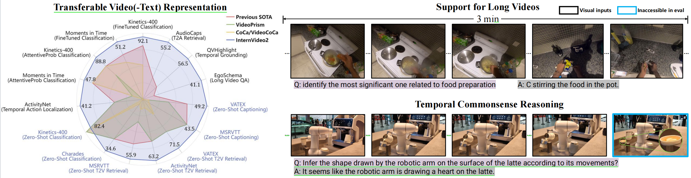

# InternVideo: Video Foundation Models for Multimodal Understanding

---

This repo contains InternVideo series and related works in video foundation models.

- [InternVideo](InternVideo1): general video foundation models via generative and discriminative learning
- [InternVideo2](InternVideo2): scaling video foundation models for multimodal video understanding
- [InternVideo2.5](InternVideo2.5): empowering video mllms with long and rich context modeling
- [InternVid](Data/InternVid): a large-scale video-text dataset for multimodal understanding and generation

## Updates
- `2025.01`: [InternVideo2.5](InternVideo2.5) is now released! Check out the [technical report](https://arxiv.org/pdf/2501.12386) for detailed insights, and access the [model](https://huggingface.co/OpenGVLab/InternVL_2_5_HiCo_R16) on HuggingFace.
- `2024.08.12`: We provide smaller models, [InternVideo2-S/B/L](./InternVideo2/single_modality/MODEL_ZOO.md), which are distilled from InternVideo2-1B. We also build smaller [VideoCLIP](./InternVideo2/multi_modality/MODEL_ZOO.md) with MobileCLIP.
- `2024.08`: [InternVideo2-Stage3-8B](https://huggingface.co/OpenGVLab/InternVideo2-Chat-8B) and [InternVideo2-Stage3-8B-HD](https://huggingface.co/OpenGVLab/InternVideo2_chat_8B_HD) are released. 8B indicates the use of InternVideo2-1B and the 7B LLM.
- `2024.07`: The video annotation for InternVid2 ([HuggingFace](https://huggingface.co/datasets/OpenGVLab/InternVideo2_Vid_Text)) is released.
- `2024.06`: The full version of the video annotation (230M video-text pairs) for InternVid ([OpenDataLab](https://opendatalab.com/shepshep/InternVidFull) | [HuggingFace](https://huggingface.co/datasets/OpenGVLab/InternVid-Full)) is released.
- `2024.04`: The [Checkpoints](https://huggingface.co/collections/OpenGVLab/internvideo2-6618ccb574bd2f91410df5cd) and scripts for InternVideo2 are released.
- `2024.03`: The [technical report](https://arxiv.org/abs/2403.15377) of InternVideo2 is released.
- `2024.01`: [InternVid](Data/InternVid) (a video-text dataset for video understanding and generation) has been accepted for spotlight presentation of ICLR 2024.
- `2023.07`: A **video-text dataset InternVid** is released at [here](Data/InternVid) for facilitating multimodal understanding and generation.
- `2023.05`: **Video instruction data** are released at [here](Data/instruction_data) for tuning end-to-end video-centric multimodal dialogue systems like [VideoChat](https://github.com/OpenGVLab/Ask-Anything).
- `2023.01`: The [code & models](InternVideo1) of InternVideo are released.
- `2022.12`: The [technical report](https://arxiv.org/pdf/2212.03191.pdf) of InternVideo is released.
- `2022.09`: Press releases of InternVideo ([official](https://www.shlab.org.cn/news/5443279) | [163 news](https://www.163.com/dy/article/HG939TNR0530QRMB.html) | [qq news](https://new.qq.com/rain/a/20220902A053JP00)).

## Contact
- If you have any questions during the trial, running or deployment, feel free to join our WeChat group discussion! If you have any ideas or suggestions for the project, you are also welcome to join our WeChat group discussion!

- We are hiring researchers, engineers and interns in General Vision Group, Shanghai AI Lab. If you are interested in working with us on video foundation models and related topics, please contact Yi Wang (wangyi@pjlab.org.cn).
